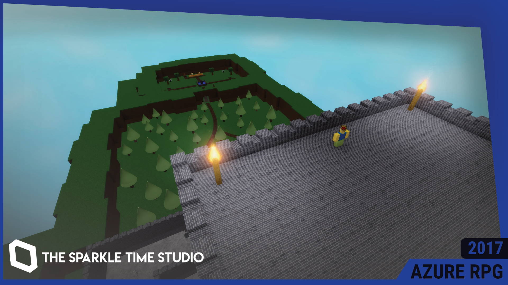

# AZURE-RPG
This was an RPG project I created in 2017, featured in a discontinued YouTube development series where I was recording some work being done on it. Eventually, this game was scrapped, but I decided to keep it open for the public. Now open source.

This repository contains the latest version of the game under The Sparkle Time Studio, version 19 (published December 23, 2020).

# Usage
Feel free to download, use, modify, distribute and publish this project to your hearts content, under the MIT License. All I ask is that you repost the original license in this document if you plan to fork this software, or give me credit (@Evercyan on Roblox) if you plan to republish it on the Roblox website.
